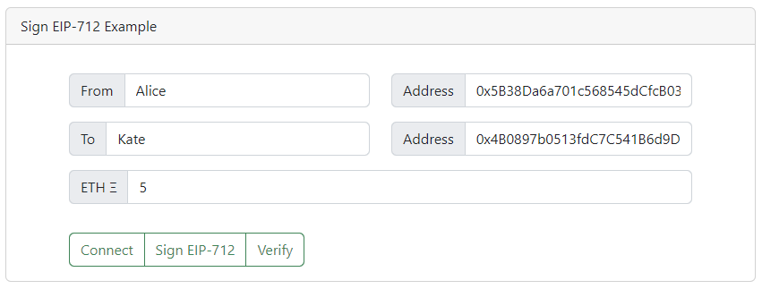
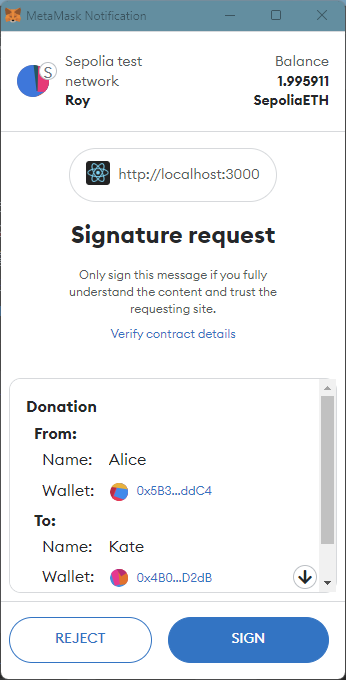

## EIP-712 서명

* [EIP-712](https://eips.ethereum.org/EIPS/eip-712) 는 메타마스크와 같은 지갑을 통해서 전자서명이 필요한 경우 사용자들에게 현재 서명하는 내용을 이해할 수 있도록 
관련 정보를 구조화해서 보여주기 위한 표준입니다.

* 이 예제는 다음과 같은 타입의 구조체 메시지에 대해 서명합니다.
  ```javascript
    const types = {
       Person: [
         {name: 'name', type: 'string'},
         {name: 'wallet', type: 'address'}
       ],
       Donation: [
         {name: 'from', type: 'Person'},
         {name: 'to', type: 'Person'},
         {name: 'value', type: 'uint256'}
       ]
    };
   ```
  예제의 메시지는 "기부" 메시지인데, `Donation`은 `from`에 해당하는 `Person`으로부터 `to`에 해당하는 `Person`에게 `value` 금액의 이더를 
전송한다는 의미를 가진 구조화된 메시지입니다. 메시지 자체는 간단하지만 약간 복잡한 구조를 가지는 형식을 예제로 삼았습니다.

  ```javascript
  const TEST_MESSAGE = {
    from: "Alice",
    address_from: "0x5B38Da6a701c568545dCfcB03FcB875f56beddC4",
    to: "Kate",
    address_to: "0x4B0897b0513fdC7C541B6d9D7E929C4e5364D2dB",
    value: "5"
  }
  ```

  

* 메타마스크를 연결하고 `Sign EIP-712`를 클릭하면 다음과 같은 화면이 팝업되고 서명하면 전자서명 메시지(signature)를 
화면에 출력합니다.

  

* 메시지의 검증은 직접 로컬에서 해도 되고 Sepolia에 배포된 컨트랙트에 항목들을 전송하여 검증할 수도 있습니다. 
`Verify` 버튼을 누르면 아래 컨트랙트의 `verifyingContract` 함수를 호출하여 전자서명한 계정의 주소를 리턴합니다.

  https://sepolia.etherscan.io/address/0x3A87C5fa9802eC4708088Ee63A98547Cc5A77D35

* EIP-712에는 `chainId`가 포함되므로 맞는 네트워크에서 실행해야 합니다. 여기서는 Sepolia를 사용합니다.

* 메시지에 대한 전자서명은 트랜잭션이 발생하지 않으므로 수수료가 필요하지 않습니다.

